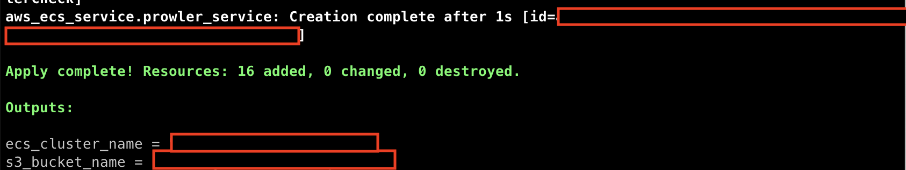
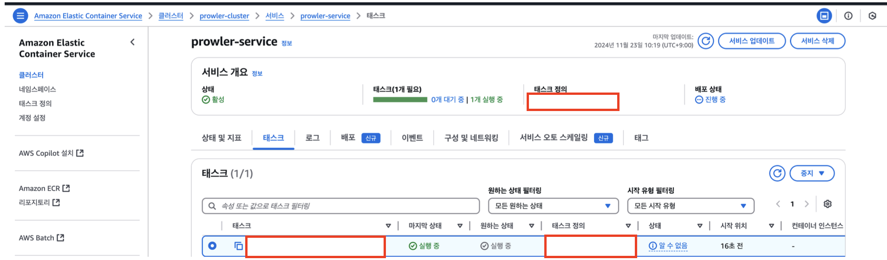
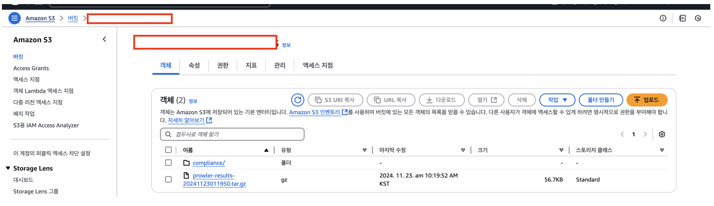
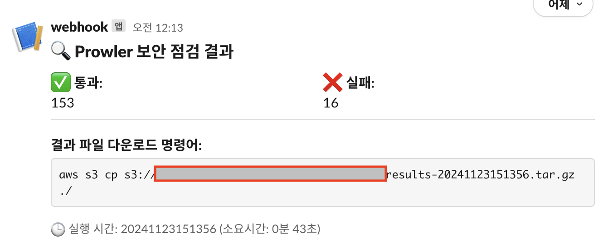
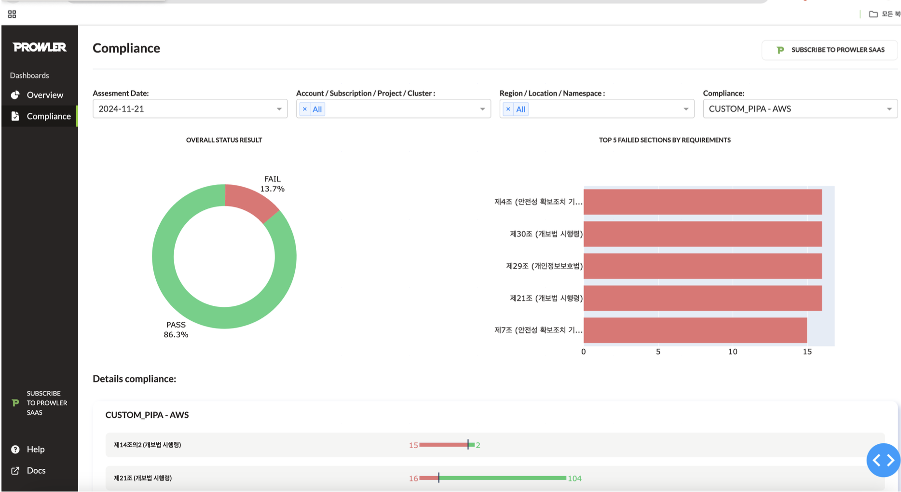
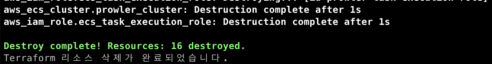

# Terraform으로 Prowler 환경 배포하기

이 리포지토리는 Apache-2.0 라이선스를 가진 [Prowler](https://github.com/prowler-cloud/prowler)를 AWS 환경에 Terraform으로 배포하기 위한 코드를 제공합니다.

## 요구 사항

1. **AWS CLI 로그인**  
   Terraform이 자원을 생성 및 관리하기 위해, 아래 권한이 포함된 IAM 계정으로 AWS CLI에 로그인되어 있어야 합니다. 로그인되지 않은 경우, Terraform은 AWS 자원에 접근할 수 없습니다.

2. **IAM 권한**  
   **awscli.json 파일에 모든 필요한 권한이 JSON 형식으로 저장되었습니다. 이 파일을 참조하여 AWS CLI에 로그인 되어있는 계정의 정책을 문제없이 수정할 수 있습니다.**

3. **Terraform 설치**  
   Terraform이 로컬 환경에 설치되어 있어야 합니다. 설치가 필요한 경우, [Terraform 공식 웹사이트](https://www.terraform.io/downloads)에서 OS에 맞는 설치 파일을 다운로드하고 설치 가이드를 참조해주시기 바랍니다.

4. **환경 변수 파일 작성 (`terraform.tfvars`)**  
   설정할 값들을 `terraform.tfvars` 파일에 입력해야 합니다. 이 파일에는 S3 버킷 이름, AWS 리전 등 필요한 변수 값이 포함되어야 하며, 이를 제외한 나머지 자원은 Terraform을 통해 자동으로 생성됩니다.

## 환경 구성 및 시작 (terraform_start.sh)

Prowler 환경을 배포하려면 `terraform_start.sh` 스크립트를 실행하세요. 이 스크립트는 필요한 IAM 역할과 정책이 이미 존재하는지 확인하고, 없을 경우 생성합니다. 그 후, Terraform을 통해 ECS 및 필요한 자원을 설정합니다.

## 환경 삭제 (terraform_stop_destroy.sh)

배포된 Prowler 환경을 삭제하려면 `terraform_stop_destroy.sh` 스크립트를 실행하세요. 이 스크립트는 배포된 ECS 서비스와 자원과 역할을 사용 모두 삭제하여 실행전과 같은 상태로 돌려놓습니다.

---

## 환경 변수 설정

`terraform.tfvars` 파일에 다음 변수들을 설정해야 합니다:

| 변수명 | 설명 | 예시 |
|--------|------|------|
| aws_region | AWS 리전 | us-west-1 |
| subnet_id | 서브넷 ID | subnet-*** |
| security_group_id | 보안그룹 ID | sg-*** |
| s3_bucket_name | S3 버킷 이름 (고유해야 함) | my-unique-bucket-name |
| slack_webhook_url | Slack 웹훅 URL | https://hooks.slack.com/services/*****/*****/***** |
| compliance_type | 규정 준수 유형 | "custom_ccpa_aws" |
| compliance_file | 규정 준수 룰셋 파일 | "compliance_rules_CCPA_2024-11-23.json" |

**규정 준수 유형 옵션:**
1. custom_ccpa_aws
2. custom_gdpr_aws
3. custom_k_pipa_aws

커스텀 룰셋은 [CustomRuleGenerator](https://yyyy7246.github.io/CustomRuleGenerator/)에서 다운로드할 수 있습니다.

## 실행 화면(./terraform_start.sh 입력)

## ECS 구성 화면

## S3 저장 화면

## SLACK 알림 화면

## [Prowler](https://github.com/prowler-cloud/prowler) Dashboard 실행 화면

## 삭제 화면(./terraform_stop_destroy.sh 입력)

실행이 완료되면 지정된 S3 버킷에서 상세한 보안 평가 보고서를 확인할 수 있습니다.

---

위 요구 사항을 충족하면 Terraform을 통해 Prowler 환경을 안전하게 배포할 수 있습니다.
